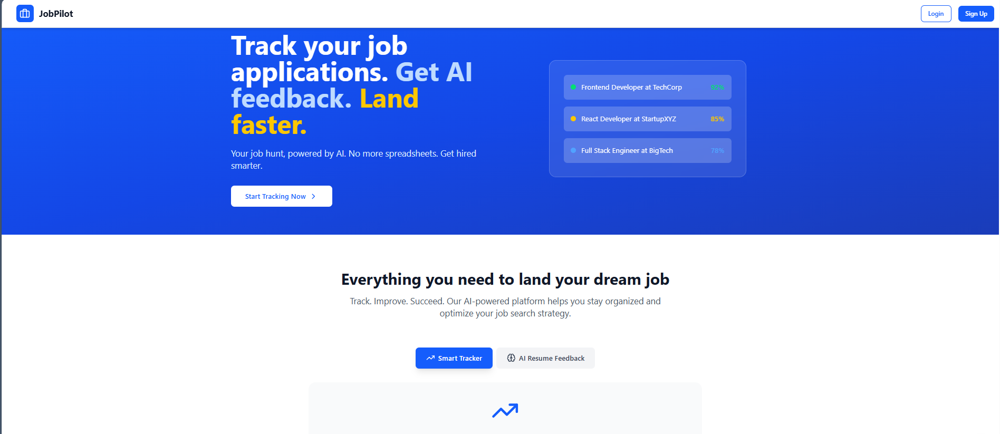
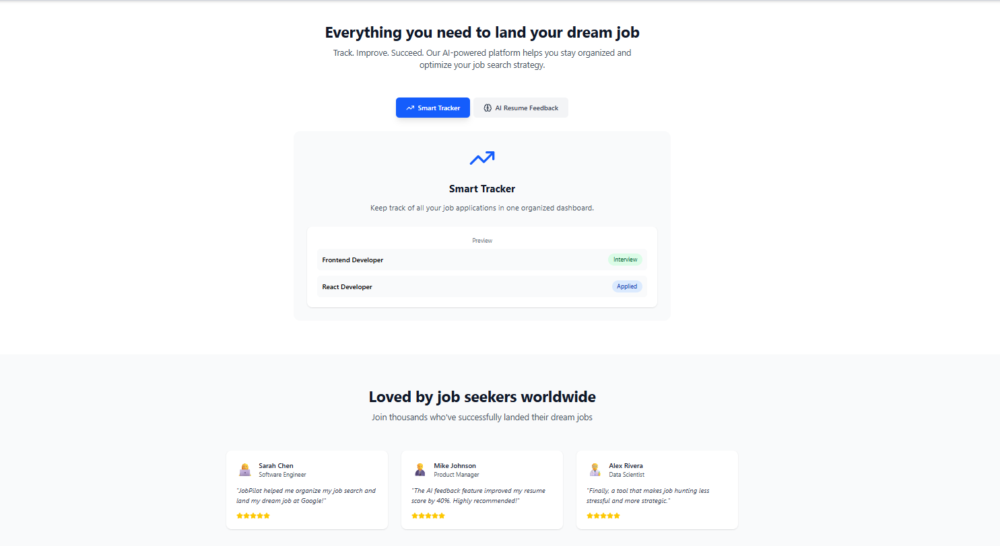
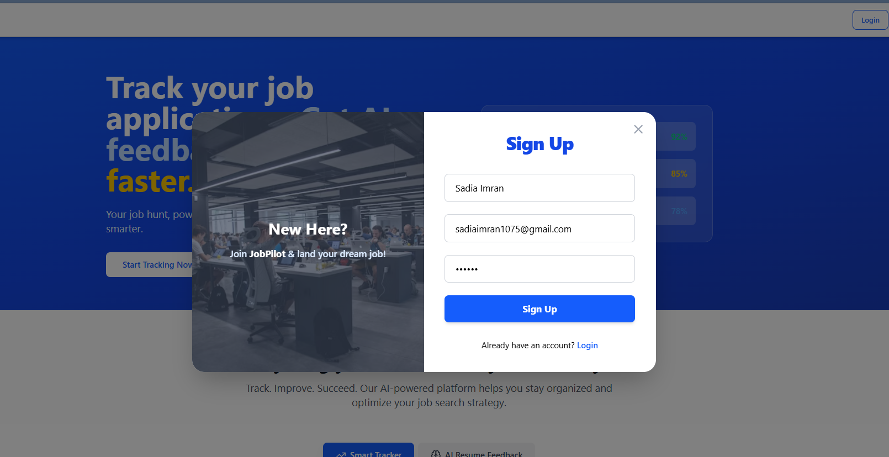
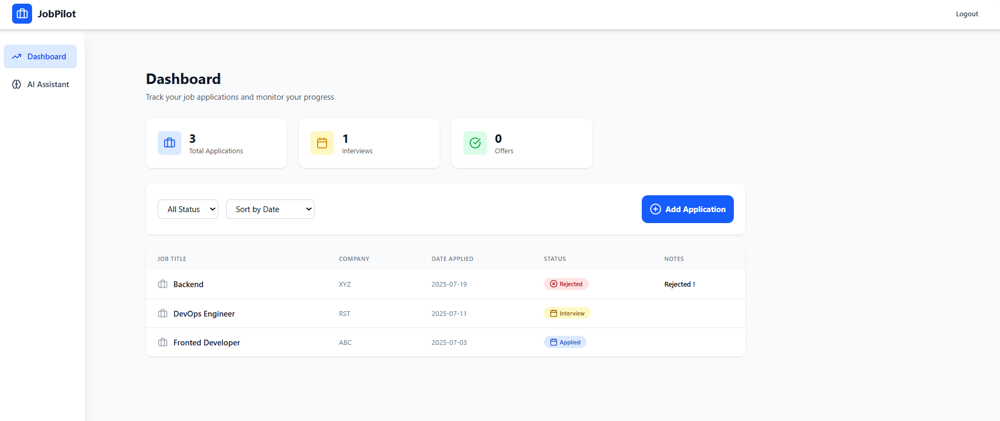
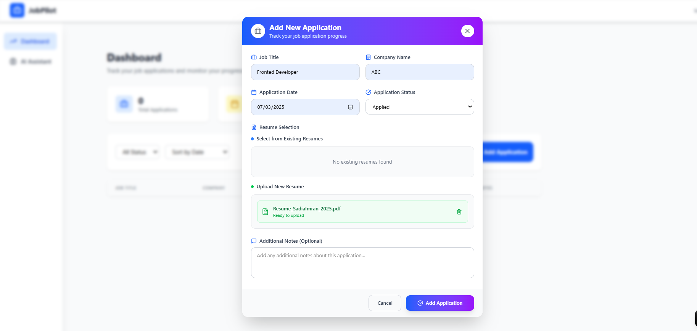
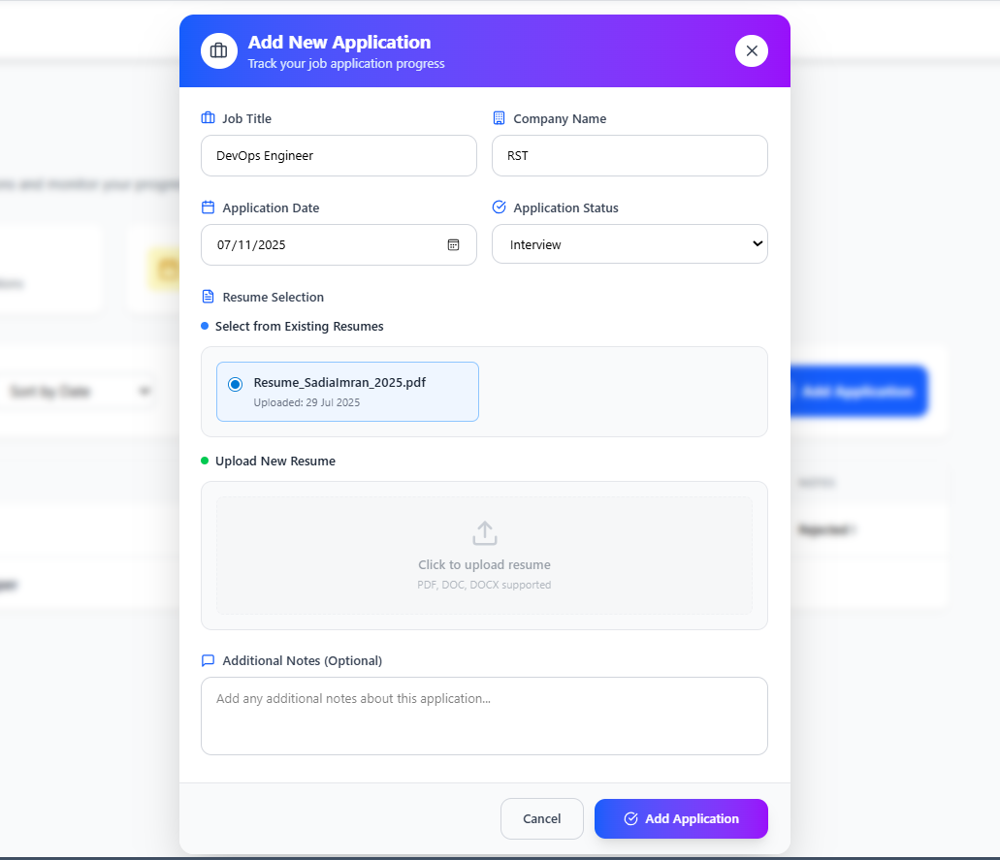
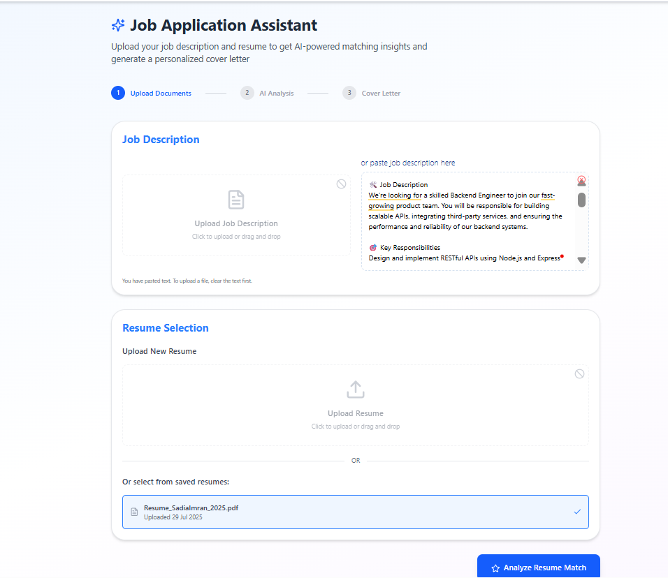
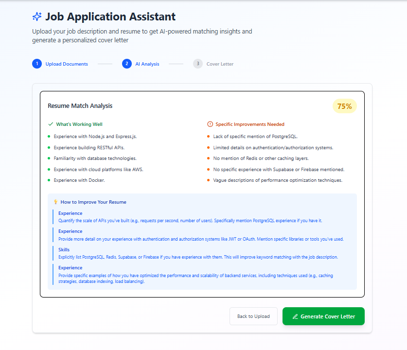
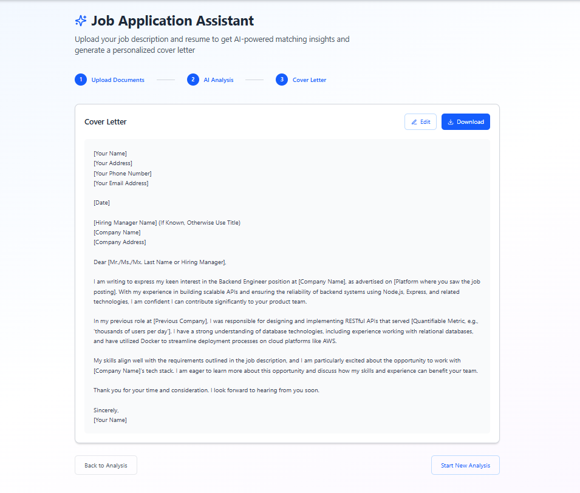

# 🚀 JobPilot - AI-Powered Job Application Tracker

JobPilot is a full-stack AI-powered SaaS application that helps job seekers organize their job applications, track progress, analyze resume match with job descriptions, and auto-generate tailored cover letters — all in one place.

🔗 **Live Site:** [https://jobpilot.vercel.app](https://job-pilot-phi.vercel.app/)  
🌐 **Backend API:** [https://jobpilot-api.up.railway.app](https://jobpilot-production.up.railway.app)

---

## 📸 Screenshots

| Feature                            | Preview                                      |
|-----------------------------------|----------------------------------------------|
| 🏠 Landing Page                   |  |
| 🏠 Landing Page (Alternate View)  |  |
| 🔐 Signup Page                    |  |
| 🧾 Dashboard (Job Applications)   |  |
| ➕ Add Application Modal          |  |
| 📂 Select Resume on Add App       |  |
| 🤖 AI Match Analysis 1           |  |
| 🤖 AI Match Analysis 2           |  |
| 📝 Cover Letter Generator        |  |

---

## 🛠 Tech Stack

### 💻 Frontend
- React.js + Vite
- TailwindCSS
- Hooks for state management
- React Router DOM

### ⚙️ Backend
- Express.js (Node.js)
- Axios for HTTP calls
- dotenv for environment variables

### 🧠 AI Integration
- Google Gemini API (Resume-Job Analysis + Cover Letter)

### 🗃️ Database & Auth
- Supabase (PostgreSQL + Supabase Auth)
- Supabase Storage (for resumes)

### 🚀 Deployment
- Frontend on **Vercel**
- Backend on **Railway**

---

## ✨ Features

- 🔐 Signup/Login via Supabase
- 📂 Upload or Select Resume
- 📋 Add & Track Job Applications
- ✅ View AI-based resume-job match score
- ✍️ Instantly generate tailored cover letters
- 💾 Stores all resume uploads in Supabase Storage
- ⚙️ Clean UI with responsive design
- 🌐 Fully deployed & integrated backend/frontend

---

## 📁 Folder Structure (Simplified)

```
jobpilot/
├── src/
│   ├── backend/             # Express server for Gemini API integration
│   ├── pages/               # Vite React frontend pages
│   ├── components/          # Reusable UI components
│   └── supabase.js          # Supabase client setup
├── public/                  # Static assets
├── .env                     # Environment variables
├── README.md
└── /screenshots             # Project showcase screenshots
```

---

## 🔐 Environment Variables

```env
# Vite Frontend
VITE_SUPABASE_URL=
VITE_SUPABASE_ANON_KEY=
VITE_BACKEND_URL=

# Express Backend
GEMINI_API_KEY=
```

---

## 🚀 Deployment Process

### Frontend (Vercel)
- Connected to GitHub
- Select framework: `Vite`
- Root Directory: `./`
- Add `.env` variables under “Environment Variables”

### Backend (Railway)
- Imported from GitHub repo
- Set `GEMINI_API_KEY` in Railway's Environment section

---

## 🙋‍♀️ About Me

**Sadia Imran**  
📫 Email: sadiaimran837@gmail.com  
💼 Backend Developer | Full Stack Engineer | DevOps Enthusiast

---

## ⭐ Like this project?

- ⭐ Star this repository  
- 🍴 Fork it and build your own features  
- 🤝 Connect with me on [LinkedIn](https://www.linkedin.com/in/sadia-imran-3b627227b)

---